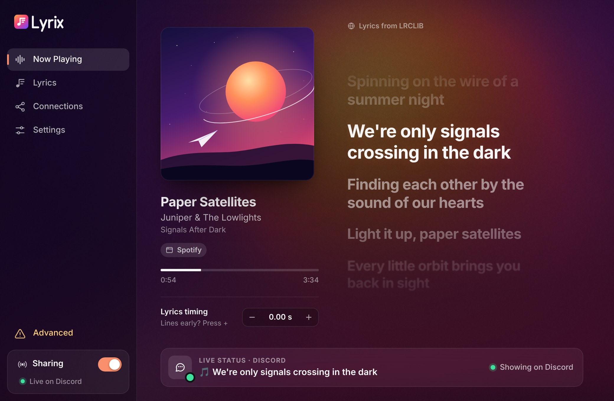
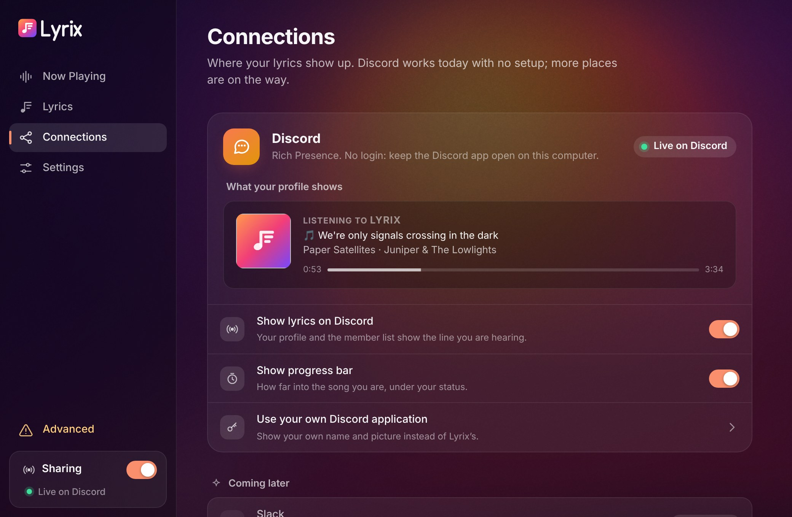
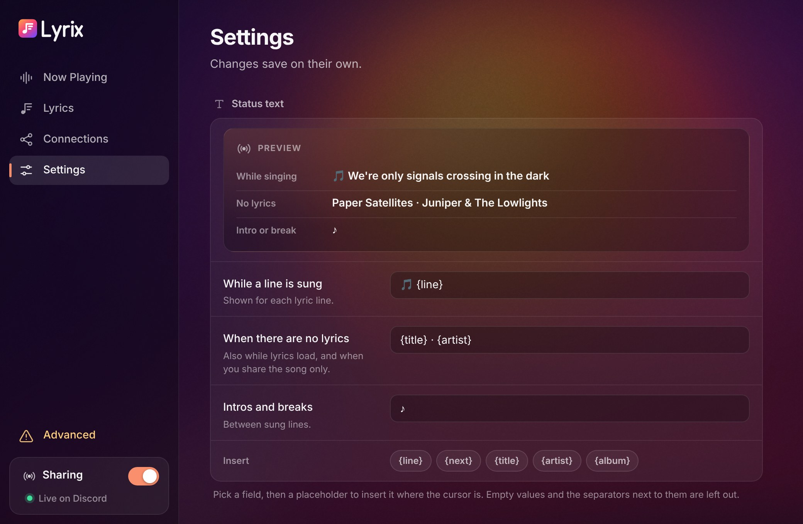
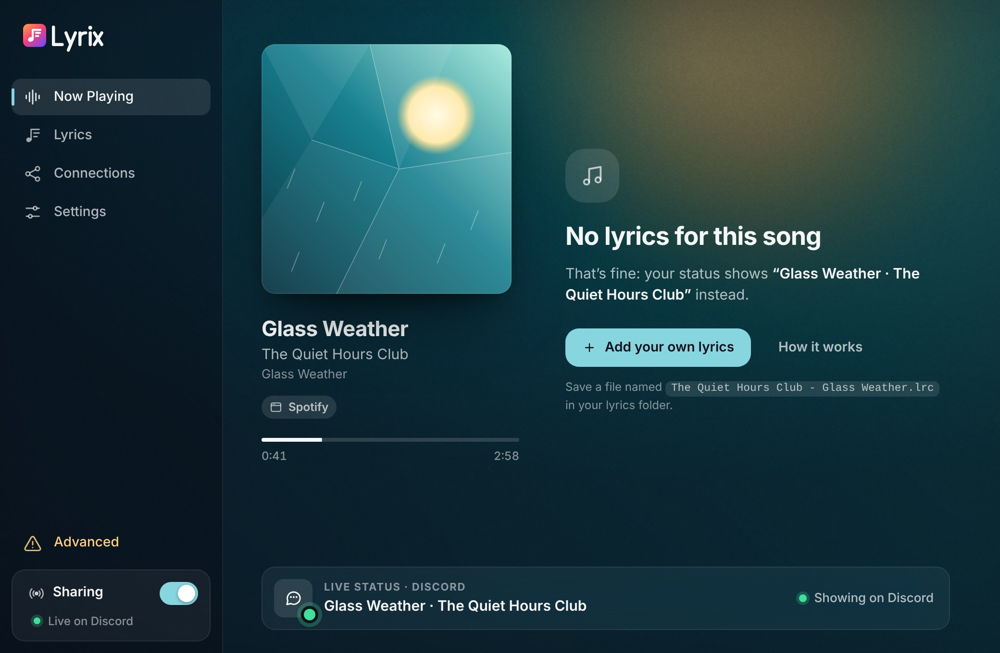
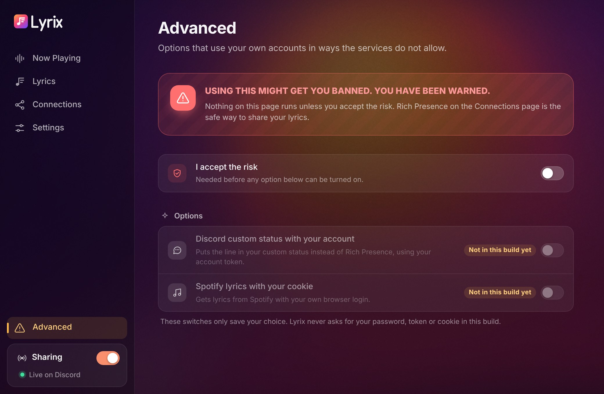
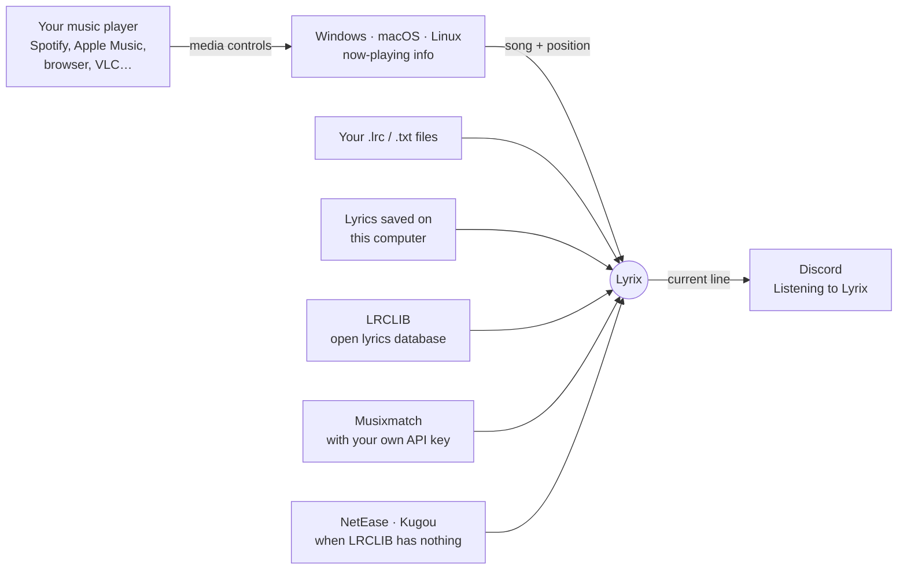

<p align="center">
  
</p>

<p align="center">
  <b>Your Discord status, singing along.</b><br>
  Lyrix shows the lyric line you're hearing right now as your status, live, while you listen.
</p>

<p align="center">
  <a href="https://github.com/Ggaming5005/Lyrixx/releases/latest"></a>
  <a href="https://github.com/Ggaming5005/Lyrixx/actions/workflows/lyrix.yml"></a>
</p>

<picture>
  <source media="(prefers-color-scheme: light)" srcset="docs/images/now-playing-light.jpg">
  
</picture>

## Why Lyrix

- **Works with almost any player.** Spotify, Apple Music, YouTube Music in the browser, Tidal, Deezer, foobar2000, VLC… If your computer's media controls can see it, Lyrix can too. No account to connect.
- **Real lyrics, perfectly timed.** Synced lyrics come from your own `.lrc` files, [LRCLIB](https://lrclib.net) (a free and open lyrics database), or, when LRCLIB doesn't have the song, Musixmatch (with your own API key), NetEase Cloud Music and Kugou. If a song has no lyrics anywhere, your status shows the song name instead.
- **Zero setup for Discord.** Open Lyrix, keep Discord running, and your profile shows **Listening to Lyrix** with the Lyrix picture, the current line and a progress bar. No token, no login.
- **Light.** A small native app that sits in your tray. The window opens only when you want it, and nothing runs on a server.
- **Yours to tune.** Status templates, a per-song timing nudge, a profanity filter, hidden apps and artists, and a "song only" mode for your work account.

## Download

| System | Get it | First launch |
| --- | --- | --- |
| **Windows 10/11** | `Lyrix_…_x64-setup.exe` | Run the installer. If Windows SmartScreen says *"Windows protected your PC"*, click **More info**, then **Run anyway**. Lyrix isn't code-signed yet. |
| **macOS 11+** (Apple silicon and Intel) | `Lyrix_…_universal.dmg` | Drag Lyrix to Applications and open it. Lyrix isn't notarized yet, so the first time macOS blocks it: open **System Settings → Privacy & Security**, scroll down and click **Open Anyway**. Then click **OK** when macOS asks whether Lyrix may control Spotify or Music. |
| **Linux** | `Lyrix_…_amd64.AppImage` or `Lyrix_…_amd64.deb` | AppImage: `chmod +x Lyrix_*.AppImage` and run it. Debian/Ubuntu: `sudo apt install ./Lyrix_*.deb`. |

Get the files from the [latest release](https://github.com/Ggaming5005/Lyrixx/releases/latest). If there is no release yet, open the [latest build](https://github.com/Ggaming5005/Lyrixx/actions/workflows/lyrix.yml?query=branch%3Amain+is%3Asuccess), scroll to **Artifacts**, and download **Lyrix-Windows**, **Lyrix-macOS** or **Lyrix-Linux** (you need to be signed in to GitHub; the download is a zip with the installer inside).

## Get started in a minute

1. **Open Lyrix.** It opens its window and adds an icon to your tray (the menu bar on macOS).
2. **Play a song** in any player. Lyrix shows the cover, the song and the lyrics, karaoke style.
3. **Keep the Discord desktop app open** on the same computer. Within a few seconds your profile and the member list show the line you're hearing.

That's it. Closing the window keeps Lyrix running in the tray; **Quit Lyrix** in the tray menu clears your status and stops it. On a desktop without a tray (GNOME without the AppIndicator extension), closing the window quits Lyrix instead. Turn on **Start Lyrix when you log in** in Settings to have it always ready.

> **Nothing on Discord?** In Discord, open **User Settings → Activity Privacy** and switch on **Share my activity**. Lyrix talks to the Discord *desktop* app, so Discord in a browser can't show it.

## A look around

| | |
| --- | --- |
|  |  |
| **Connections.** See exactly what your profile shows, switch the progress bar, or use your own Discord application name and picture. | **Settings.** Write your own status with `{line}`, `{next}`, `{title}`, `{artist}` and `{album}`, with a live preview. Changes save on their own. |
|  |  |
| **No lyrics?** Your status shows the song instead, and one click opens the folder for your own `.lrc` file. | **Advanced mode.** Riskier options live behind a clear warning and stay off by default. |

## How it works



1. **What's playing.** Every music app reports what it plays to the operating system, so it can appear in the media controls. Lyrix reads that: title, artist, album, length and position. It never records or listens to audio.
   - Windows: the system media sessions (every app in the volume/media flyout).
   - Linux: MPRIS, which nearly every player and browser supports.
   - macOS: Spotify and Apple Music. For every other app in the Now Playing widget, install [mediaremote-adapter](https://github.com/ungive/mediaremote-adapter) and set `sources.macos_adapter_dir`.
2. **Lyrics.** Lyrix looks in this order: your own files, lyrics it saved before, LRCLIB, Musixmatch if you [added your key](#musixmatch-with-your-own-key), then NetEase Cloud Music and Kugou, two big catalogs (especially for Chinese, Japanese and Korean songs) that need no account. They aren't official services, so they may stop answering one day; each has its own switch on the Lyrics page. Credit lines such as "Lyrics by" are left out, and lyrics without timing are spread across the song and marked as estimated.
3. **Your status.** Lyrix keeps its own clock between readings, picks the line for this exact moment, and updates Discord no faster than Discord allows: at most 5 times every 20 seconds. When lines come faster than that, Lyrix skips some, and when a new line is about to start it waits a moment for it, so Discord shows the line being sung rather than one about to end.

## Your own lyrics

Put `.lrc` (timed) or `.txt` (plain) files in the lyrics folder. **Lyrics → Open folder** in the app takes you there. Name them `Artist - Title.lrc`; letter case, accents, punctuation and extras like "(Remastered)" don't matter. Your `.lrc` files always come first, even for songs Lyrix found before; a `.txt` is used when no timed lyrics are found.

```
[00:12.40] We folded maps into paper planes
[00:16.90] And threw them out of the seventh floor
```

Lines a bit early or late for one song? Use **Lyrics timing − / +** on the Now Playing page. Lyrix remembers it for that song.

## Troubleshooting

<details>
<summary><b>Discord doesn't show my status</b></summary>

- The Discord **desktop** app must be running on the same computer (not Discord in a browser).
- Discord → **User Settings → Activity Privacy → Share my activity** must be on.
- In Lyrix, the **Sharing** switch (bottom left) must be on. The **Live status** card on Now Playing tells you what Discord gets and whether Lyrix is connected.
- Started Discord after Lyrix? Lyrix reconnects on its own within about 15 seconds.
- Lines change on Discord every 4 to 5 seconds at most. That is Discord's own limit (5 updates every 20 seconds; faster updates get dropped and freeze the status), so with fast lyrics some lines are skipped.

</details>

<details>
<summary><b>Lyrix follows the wrong player</b></summary>

When several apps play, Lyrix picks the one that is playing. To ignore an app for good (say, your browser), add it under **Settings → Privacy → Ignore these players**.

</details>

<details>
<summary><b>It says "Nothing playing" on macOS</b></summary>

Without mediaremote-adapter, Lyrix reads Spotify and Apple Music only. If macOS asked whether Lyrix may control Spotify or Music and you clicked **Don't Allow**, turn it back on in **System Settings → Privacy & Security → Automation → Lyrix**.

</details>

<details>
<summary><b>macOS says Lyrix "is damaged and can't be opened"</b></summary>

That is macOS reacting to an app downloaded from the internet that isn't notarized, not real damage. Run this once in Terminal, then open Lyrix again:

```sh
xattr -cr /Applications/Lyrix.app
```

</details>

<details>
<summary><b>Is it safe for my Discord account?</b></summary>

Yes. Everything on by default uses Discord's official Rich Presence, the same feature games and music apps use. Lyrix never asks for your password or token. The only exceptions are the options in Advanced mode, which are off by default and come with a warning.

</details>

## Musixmatch with your own key

Musixmatch has lyrics for most songs, and Lyrix can ask it through its official API with your own key. Create one at [developer.musixmatch.com](https://developer.musixmatch.com), then paste it under **Lyrics → Musixmatch** in the app. The key stays in Lyrix's settings on your computer.

- Timed lyrics need one of Musixmatch's paid plans. The free plan sends only part of each song's words, without timing, and Lyrix doesn't use those, so a free key finds no lyrics.
- Only keys from developer.musixmatch.com work. Tokens taken from Musixmatch's own apps don't.
- Lyrix doesn't save Musixmatch's lyrics, so it asks again each time a song plays, and every lookup counts toward your plan's limit. For each song it gets lyrics for, it opens Musixmatch's tracking link, which is how Musixmatch counts views.

## Advanced mode

> [!CAUTION]
> **USING THIS MIGHT GET YOU BANNED. YOU HAVE BEEN WARNED.**

Advanced mode holds switches for options that use your own account in ways the services don't allow: a Discord custom status set with your account, and Spotify's own lyrics through your browser login. Nothing there runs unless you accept the risk first. These connectors are not in this build yet.

## Coming later

More places for your lyrics: Slack, Telegram, GitHub, Matrix, Microsoft Teams, an OBS overlay for streamers, and webhooks.

## Command line and building from source

Lyrix also comes as a small `lyrix` command for terminals and servers (`lyrix now`, `lyrix lyrics`, `lyrix run`, `lyrix pause`, `lyrix offset +300`…). It shares its settings with the app. Every command, every setting and how to build both are in [app/README.md](app/README.md).

```sh
git clone https://github.com/Ggaming5005/Lyrixx.git
cd Lyrixx/app
cargo run -p lyrix-desktop     # the app (Linux needs the WebKitGTK 4.1 dev packages)
cargo run -p lyrix -- now      # the command
```

## Credits

- Lyrics from [LRCLIB](https://lrclib.net), a free, open, community lyrics database, from [NetEase Cloud Music](https://music.163.com) and [Kugou](https://www.kugou.com), and from [Musixmatch](https://www.musixmatch.com) with your own API key.
- Inspired by [BlueCatSoftware/Lyrix](https://github.com/BlueCatSoftware/Lyrix).
- Built with [Rust](https://www.rust-lang.org) and [Tauri](https://tauri.app).

<details>
<summary><b>Legacy: the original Lyrixx web API</b></summary>

Before the app, Lyrixx was a Node.js REST API (`index.js`, deployed on Vercel) that fetched synced lyrics for Spotify tracks:

- `GET /getLyrics/{trackId}`: lyrics by Spotify track ID.
- `GET /getLyricsByName/{artistName}/{trackName}?remix={true|false}`: lyrics by artist and track name.

It stopped working when Spotify changed how its web player hands out access tokens. The code is kept for reference.

</details>

## License

MIT. See [LICENSE](LICENSE).

Questions? Reach out on [Discord](https://discord.com/users/687322874100580368).
